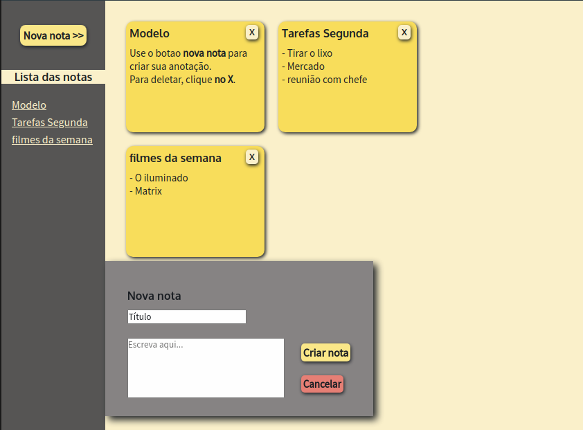

# bloco-de-notas
Quadro de notas ao estilo post-it (html/css/js)

Página criada como prática de HTML/CSS e JavaScript. 
Os itens que destaco abaixo servem como registro dos elementos que estou estudando.
 
### Principais elementos aplicados:
* Organizando a lista de notas gerada em uma Array de Objetos:
  ```javascript
  const noteList = [{...}]
  const nota = { id: '', title: '', content: '' }
  noteList.push(nota)
  ```

* Gerador de uma ID "aleatória" (ou quase) para cada nota:
  ```javascript
  nota.id = Math.round(100000 * Math.random())
  ```

* Criação de elementos html via javascript
  ```javascript
  createElement()
  setAttribute()
  appendChild()
  ```

* Manipulação de css adicinando novo atributo class via javascript
  ```javascript
  document.getElementById('someID').classList.add('someClass')
  document.getElementById('someID').classList.remove('someClass')
  ```

* Event listener para o fim de uma animation
  ```javascript
  addEventListener('webkitAnimationEnd', function(){} )
  ```

* Uso de variáveis no css
  ```css
  :root {
    --primary-color: #hexcode;
   }
   div {
    background-color: var(--primary-color);
   }
  ```
 
 * Alterando visibilidade de elemento com opacity e z-index:
    ```css
    .box-transition {
      animation: show-up 0.5s forwards;
      z-index: 1 !important;
    }

    @keyframes show-up {
      0% {
        opacity: 0;
      }
      100% {
        opacity: 1;
      }
    }
    ```


